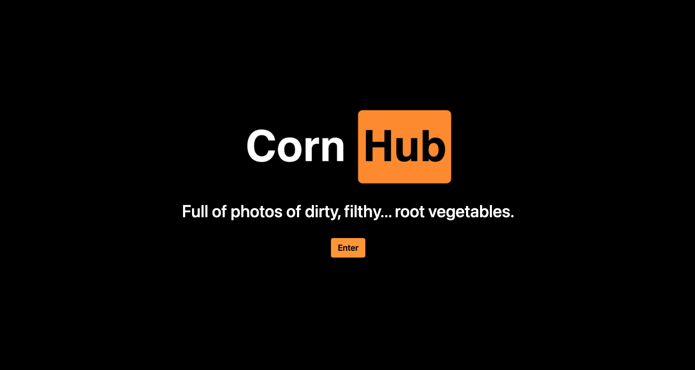
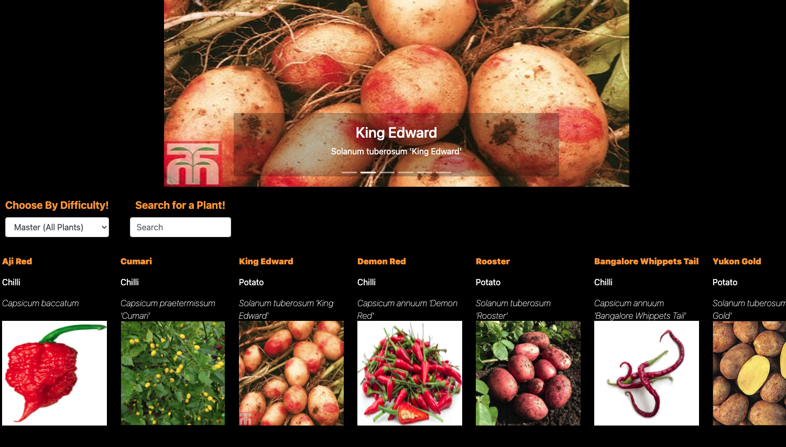
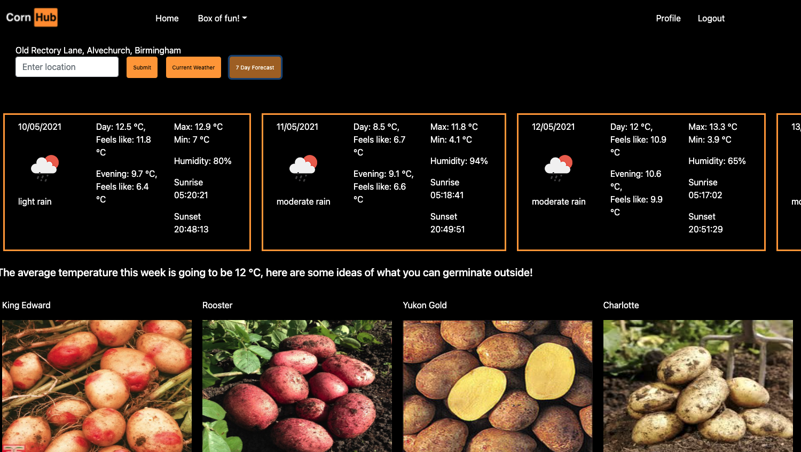
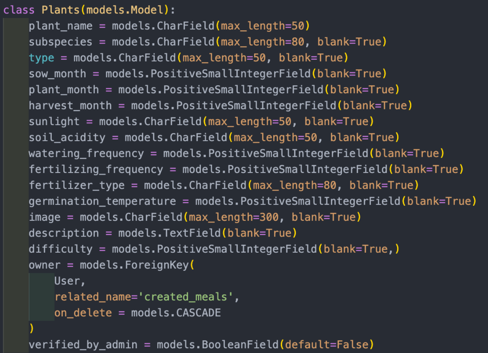
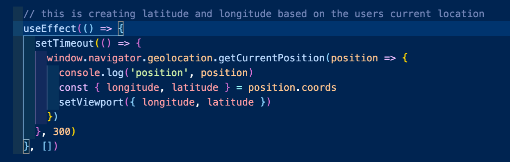
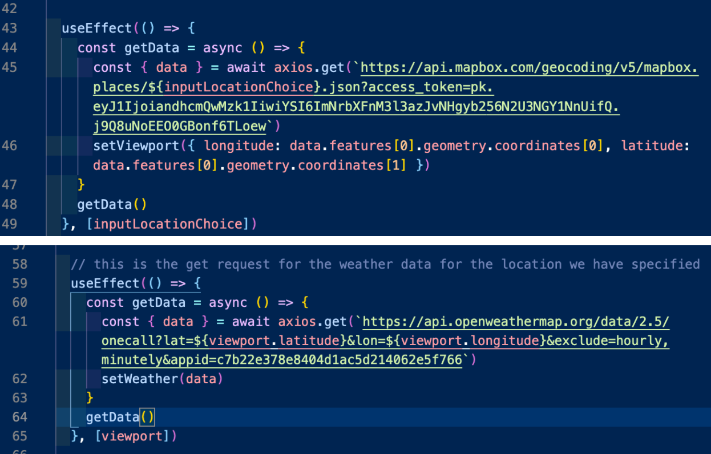
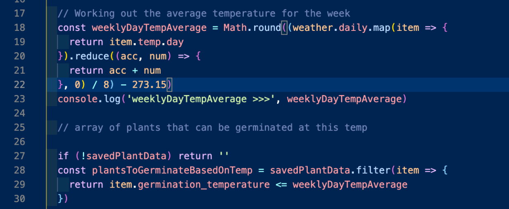
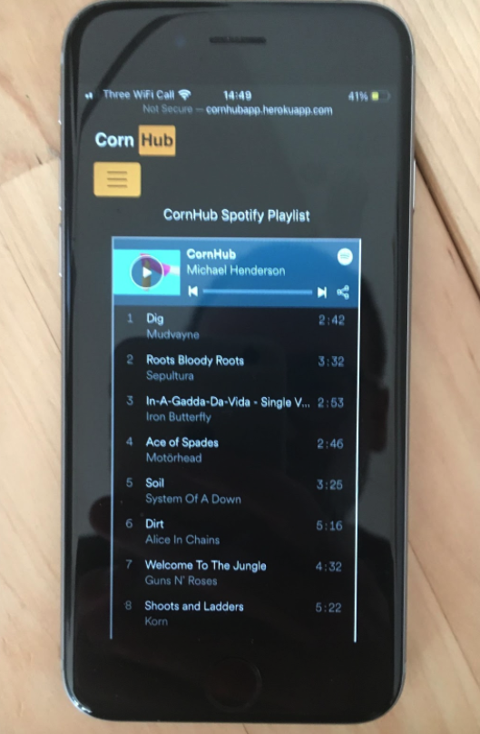

# CornHub
Gardening app for hardcore gardeners

----

# Project Brief 
In one week, build a full-stack app (PostgreSQL, Python/Django, React) with CRUD functionality, working solo, in a pair, or in a group of three. I was asked to join a group with Paddy Johnson and Michael Henderson, two like-minded lockdown gardeners! 
 
## Link to Deployed Project
http://cornhubapp.herokuapp.com/

# Overview and Concept
I have discovered a real love for gardening during the first lockdown. When I am looking to grow plants, I often have to consult multiple sources in order to find all of the information I need concerning sowing, fertilizing, watering and many other things, and having to re-visit these sites to check this information. Paddy came to me and briefed me on his concept for a full stack gardening app that would have all of this information stored in one place, with several different approaches to searching and filtering - for example, by month, name, species, temperature or difficulty. The design and aesthetic of the app was to bring a humorous and dark theme to what is traditionally known as a cosy, middle class hoby, but something we believed to be anything but, which was the inspiration for the aptly named CornHub app. 

# Technologies Used

* Python
* Django
* PostgreSQL
* React
* JavaScript
* CSS
* React-Bootstrap
* GitHub
* Heroku

# Approach Taken

## Introduction and planning 
The idea for the project came mostly formed- Paddy had been thinking about the project a few days prior to the start of the project. Once Michael and I had been recruited, we promptly fleshed out the pseudocode, with post-MVP features even listed in order of preference, and wireframes of design layout and user flow were made on Exacalidraw. We started a Trello for visibility, task assignment and assessment of priorities, and a Google Sheet for collecting information for our database. Crucially, we outlined models for our User and our Plants with every field that we felt we might conceivably need, so as to avoid having to make subsequent changes. 

We were at this stage still getting to grips with Django, and were looking to avoid potential problems; this also meant that our starting point was to work in a group until our back end was built out completely and our front end was attached and requests tested. We also spent an evening individually researching CSS frameworks, and decided that React-Bootstrap was the one for the job. 

With all of this done, it became much easier to assign solo tasks. As a general rule throughout the project, we worked as a full group on the most complex tickets, and saved the more straightforward, or personal interests for evenings and the weekend. This was not our original plan, but we discovered while building the back end together that we had a terrific dynamic as a group, both in terms of skills and morale, and it made sense to take advantage of this as much as possible.

One of our ongoing solo tasks was of course adding to our data set. This proved to be quite time consuming, owing to the number of fields on the Plants model, and our emphasis on accuracy. Thankfully, spending hours researching chillies and herbs was hugely enjoyable.

The tasks that I took responsibility for as solo tasks were the integration of the OpenWeather API, a PayPal integration, and the functionality of the profile page (aside from watering reminders which was a collective mission!)

The integration of paypal and a weather API were my ideas to add to the project, and i wanted to see them from concept through implementation. 

## Weather page 
The first of the solo tasks I decided to tackle was the integrating a weather API. The idea behind this was to incorporate a weather forecast app into the site that would default to the users current location, but would be changeable to allow the user to search other locations to facilitate planning gardening jobs. To this end, I decided to incorporate the temperature from the API, and make suggestions of what to sow based on the week's forecasted temperature. Below is a gif of the final product!

The first task was to use the browsers inbuilt geolocator, and use this data to send a request to the OpenWeather API to return weather data for the user's current location. This ended up being relatively straightforward once I updated my browser to a new version. As shown below, the viewport was set based on the user's current location. 

The next task was to enable the user to be able to search for different locations' weather. The simplest way to achieve this seemed to be to use forward geolocation functionality from Mapbox. This takes an input of text, and returns that location's coordinates. What impressed me about this geolocation from mapbox was its flexibility, taking postcodes, street addresses, cities and even abbreviations of major cities like NYC for New York! As shown below, the geocoding from mapbox was used to update the viewport. I passed viewport as a second variable into the useEffect for getting the weather data. This allows the weather to update when the viewport changes. 

I then added a feature to display what location the displayed weather information related to. This called for the use of reverse geocoding to change the coordinate used to get the weather to be converted into text so that it could be displayed to the user. This was achieved in a similar manner to the forward geocoding and provided a nice user. 

Now that the data was being pulled in, I added some visualisation of this information being returned from the API. I created a current weather, and seven day weather function. This was achieved by mapping through the data returned from the API, and rendering it on the page. I split the functionality of the weather page into their own components to have a more readable and maintainable code base. 

The final functionality for the weather page was some temperature specific information for which plants could be sown outdoors. This required me to map through the data, and use .reduce to sum up the daily temperatures to calculate the average temperature for the week. I then ran a filter on the plant data so that only plants that met the criteria would be returned on the weather page. The nice thing about this is it updates when locations are changed! Once I returned an array of plants that met the criteria, I mapped through this to display the relevant data about the plants on the page. 

## PayPal integration 
The integration of PayPal started off as a very challenging proposition. I spent a large portion of one of my weekend days trying to figure it out to no avail. I went back to the drawing board, spoke to my team and came up with a plan. I reset, went back to through information online, and ended up with a simple solution. Once the paypal integration was working, I modified it so that it could take custom donation amounts. 

## Resposive design
A crucial styling feature that we incorporated across the board was responsive design. This was due, almost entirely, to the fact that I wanted to integrate a Spotify plugin (complete with a playlist of predominantly metal songs with gardening pun names), and knew that gardeners would be listening on a mobile device:

Purely because of this one feature, the entire site works on mobile. Similarly, we made a point of being as comprehensive with error handling and conditional rendering as we could possibly think of.

## Watering reminders
The most ambitious feature of our app, by far, was the optional watering reminder for each saved plant. Building this involved several steps and a lot of experimentation, and was absolutely a collective effort. In a nutshell, this is how it works:

Clicking the reminder button generates a Date.now() timestamp and saves it to local storage, along with a payload of the plant ID, the watering frequency, the plant name and an instruction to water
On page load, a new Date.now() is generated and saved to state
On page load, the reminder payload is retrieved from local storage
The watering frequency is multiplied by 86.4 million (the number of milliseconds in a day) and added to the timestamp from the payload
This figure is compared to the current Date.now()
If the payload figure is the lower of the two numbers, a toast reminder is displayed, with a reminder to water, and the name of the plant to water; it will display a list if multiple plants need watering
When the toast appears, the payload is removed from local storage; accordingly, the toast also displays an instruction to click the reminder button again if further reminders are wanted

For presentation purposes, we expedited the watering_frequency * 86.4 * 100000 figure to a mere five minutes; but in the deployed version, the original figure remains.

# Bugs, Blockers and Wins

## Known or suspected bugs
One or two images from the database don’t load
Scrollbars may not stay hidden on Firefox
Default germination temperature is not the same on PlantShow as it is on NewPlant

## Blockers

We did have to abandon profile images for the user, as we were unable to get our requests to Cloudinary to work as intended; however, we also realised we didn’t have much of a need for this feature in the first place
Deployment to Heroku resulted in the PlantShow page remaining blank unless the user was logged in. Eventually we figured out that we needed to refactor our GET request for the current user, so that the app wouldn’t hang if local storage was empty

## Wins

As a team, we set ourselves a project which had a lot of stretch goals. Aside from adding in a fertilizing reminder in addition to the watering reminder we have managed to hit all of our goals for the project, and come up with a project we are all  very proud of
The team all were completely committed to the project, and it was a joy to work with a group that were all motivated to achieving the same goal. 

## Key Learning and Future Features

Learning-wise, my biggest takeaway is the power of teamwork. Without Paddy and Michael, this project would have been substantially smaller and far less interesting, and some of the features (especially the watering reminder) would have been impossible to build without the combined mental power of the three of us. Working with a group of talented coders meant that one of us always had the answer to the others problems, and building out more complex components was much smoother. 

In terms of future features, on the whole the three of us are extremely happy with the end result; however, some additions could include:

Reminders for fertilization
Some fine-tuning on the aspect ratios for the plant photos
Changing PayPal integration from test to live
A mailto: link for users to make suggestions about plant edits
